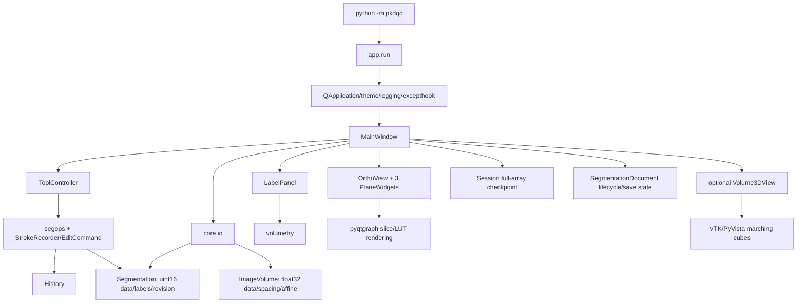
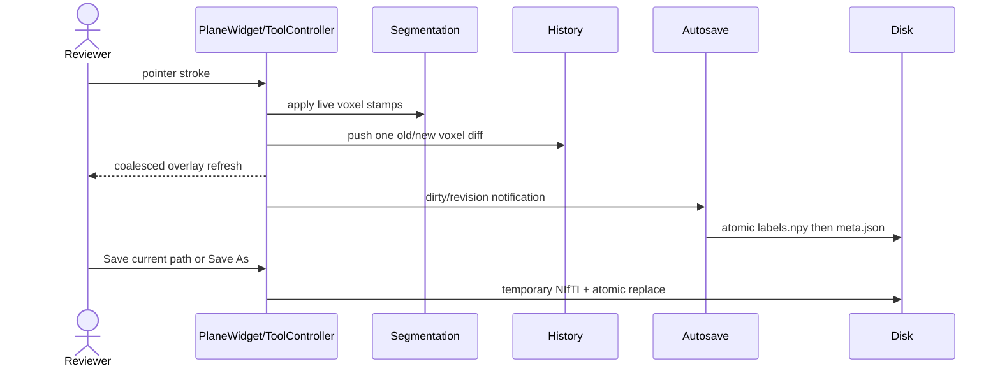

# Architecture and data flow

## Current architecture



Qt-free `core` is mostly a domain layer; `MainWindow` is composition root and controller;
`OrthoView` owns display/navigation interaction; `ToolController` translates gestures into
domain commands. `layers.py` sketches a future multi-segmentation model but is unused.

## Startup through shutdown

1. `pkdqc.__main__` calls `app.run`; logging, QApplication, theme and exception hook are
   installed, then `MainWindow(enable_3d=True)` is shown.
2. Startup scans Recovery v2 generation directories and offers only checkpoints whose schema,
   data checksum, array contract, revisions, geometry, and source-file identity validate. A
   corrupt newest generation falls back to an older valid one; legacy v1 is never trusted as v2.
3. Opening NIfTI uses nibabel closest-canonical RAS+, float32 image data and a validated `ImageGeometry` containing canonical affine, spacing, orientation, handedness, voxel volume and voxel/world transforms. DICOM discovery groups candidate image series by technical identifiers, requires one selected valid scalar 3D series, and builds patient geometry from Image Orientation/Position Patient and Pixel Spacing.
4. Loading labels independently canonicalizes NIfTI, requires equal shape and approximately
   equal canonical affine, then creates label metadata from unique IDs.
5. `_set_case` creates history/controller/view/panel/session state, centers the crosshair,
   computes volume, and schedules a synchronous 3D build.
6. Plane extraction transposes and flips the two in-plane axes. One shared voxel cursor
   selects depth in all panes. `Plane.disp_to_vox*` is the inverse used for edits.
7. Brush/lasso mutate the contiguous segmentation immediately, then commit a flat-index
   old/new diff. Region operations create replacement arrays then derive a diff. History
   restores exact voxel values; refresh, dirty state, and autosave are controller signals.
8. Periodic/idle/edit-count recovery synchronously commits an immutable generation containing
   a checksummed `.npy` and versioned manifest. Manual save writes a temporary NIfTI using the
   image affine and renames it, then retires recovery because no unsaved work remains.
9. Close and case replacement pass through the shared dirty-document guard. Save must finish,
   Discard explicitly removes the checkpoint, and Cancel preserves the complete current case.

## Geometry contract (current and required)

Current NIfTI internal axes are nibabel RAS+ `(X,Y,Z)`, despite some legacy variable names
`row,col,slice`. Spacing aligns with those array axes. Axial depth is Z, coronal Y, sagittal
X. Pixel aspect uses physical in-plane spacing. `ImageGeometry` now makes the RAS+ convention explicit and supplies affine-derived patient markers, determinant-based voxel volume, and geometry validation before display/editing.
DICOM source images are converted from patient LPS geometry into the same canonical RAS+ contract; unsupported DICOM geometry is blocked rather than displayed deceptively.

Required invariant:

```text
world_ras_mm = affine_ras @ [i, j, k, 1]
seg.shape == image.shape
allclose(seg.affine, image.affine) OR explicit nearest-neighbor resampling is approved
display voxel <-> source voxel is a tested bijection
label resampling is nearest-neighbor only
volume_mm3 = count * abs(det(affine[:3,:3]))
```

Use the affine determinant rather than only zoom products as the authoritative voxel volume,
while rejecting shear/non-orthogonal cases that the viewer cannot faithfully model. Display
patient-axis markers must derive from affine, never pane names or hard-coded flips.

## Edit/save flow



`SegmentationDocument` is the Qt-free authority for the current segmentation path,
never-saved status, saved revision, and revision-derived dirty state. `MainWindow` injects
native path/overwrite decisions and uses one document guard for close, image replacement,
segmentation replacement, blank creation, and drag/drop replacement. Save commits the saved
revision (and Save As commits its new path) only after the atomic writer returns successfully.

## Rendering and controls

Image slices are uploaded with window levels; integer label slices use an RGBA LUT and an
extra selected-label alpha mask. Wheel changes the active pane depth, Ctrl-wheel zooms,
Alt-wheel changes voxel-radius brush size, middle drag pans, and right drag zooms except
when Brush/Lasso scopes it to active-label erase. Crosshairs update all planes. A 3D mesh is
built on demand or continuously; failures are isolated by an unavailable placeholder, but
actual builds are synchronous.

## Recommended incremental target

Keep the current core/UI separation; do not rewrite. Add (1) validated `ImageGeometry` and
`LabelVolume` input contracts, (2) `CaseDocument` owning the reference image, optional comparison layers, editable
layers, provenance and lifecycle, (3) transactional edit/compound-command services, and
(4) revision-aware background task services. `MainWindow` should coordinate these services,
not own persistence and computation details. Workers return results tagged with document and
revision; stale results are discarded on the UI thread.


## Product scope clarification (Round 1A)

The target is a general-purpose segmentation workstation: a user may load and edit an existing mask or create a blank mask and segment manually. AI QC is one important workflow. Organ and cyst files are independent and opened one at a time. Standard Save writes the current segmentation path; Save As selects a path/format, and an explicit confirmed overwrite is valid. Comparison baselines and provenance sidecars may be optional future features, never mandatory foundations.

## Round 1C geometry and orientation

`ImageGeometry` is the central Qt-free geometry contract. It validates finite, non-singular, orthogonal NIfTI affines, accepts oblique rotations/flips without reslicing, rejects shear/non-orthogonal geometry, and records warnings for ambiguous millimetre units. Plane markers and measurement volume now derive from the affine rather than pane names or header zoom products alone. See `docs/GEOMETRY_CONTRACT.md` for the full qform/sform, display, units, segmentation compatibility, and known-limitation policy.

## Round 1D DICOM source images

DICOM loading now uses `core.dicom` discovery candidates instead of directory-wide stacking. Classic slices are sorted by position projected onto the slice normal, Enhanced CT/MR multiframe is accepted only when functional groups describe one regular scalar volume, and Recovery v2 source identity stores a PHI-safe aggregate of technical identifiers, file fingerprints, loaded shape, affine, and spacing. Segmentation import remains NIfTI-only; DICOM SEG is rejected with a clear unsupported message. See `docs/DICOM_GEOMETRY.md`.

## Round 1E background processing

`BackgroundTaskService` tags work by document id, revision, task type, and parameters. Workers operate on read-only snapshots and return new values; `MainWindow` drains results on a Qt timer and applies only non-stale results. Volumetry and autosave use latest-only coalescing, cleanup operations apply one undoable command only when the source revision still matches, and case replacement/shutdown cancel pending work. See `docs/BACKGROUND_PROCESSING.md`.

## Round 1F Region Review

Region Review is implemented as a review/navigation layer over ordinary segmentation labels.
`core.regions` builds a Qt-independent connected-component index from immutable revision
snapshots and records per-component and per-label measurements without changing numeric label
values. The index supports connected-region, label/color, and label-with-components grouping,
6/18/26-neighbour connectivity, determinant-based volumes, stable fingerprints, review-state
remapping, exact component deletion, and explicit whole-label deletion. `MainWindow` submits
index builds through `BackgroundTaskService` and applies only non-stale results; navigation and
isolation do not enter undo history or modify voxel data. Review progress is stored atomically
under the application data directory with PHI-safe technical identity hashes rather than NIfTI
sidecars. See `docs/REGION_REVIEW.md`.

### Region Review hardening

Round 1F.1 keeps component analysis in `core.regions` and leaves live voxel data
owned by `Segmentation`. `MainWindow` is limited to task scheduling, UI state,
and applying validated edit commands. Region Review shortcuts are context-gated
so ordinary editing remains available without entering review mode. Custom label
names/colors are UI metadata and are not claimed to survive NIfTI Save/Save As;
numeric label values remain authoritative.
